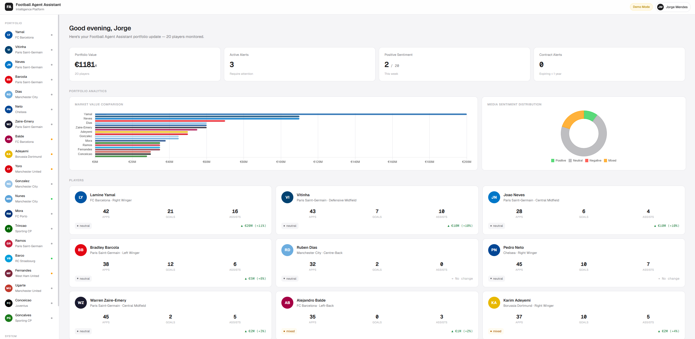
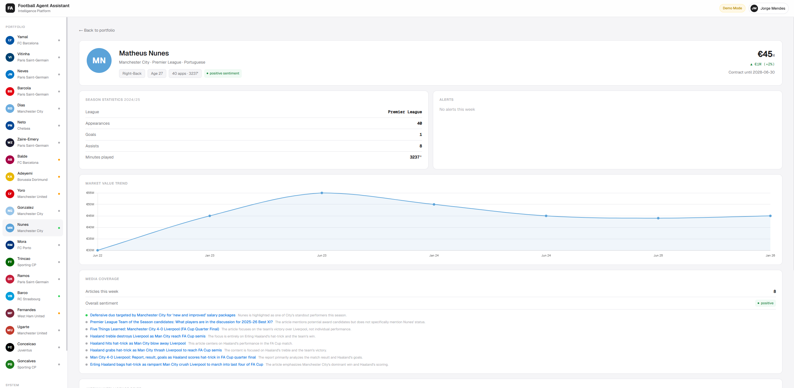
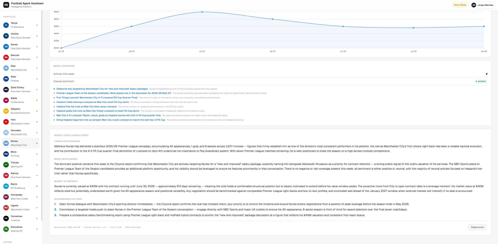

<div align="center">
  

  <h1>Football Agent Intelligence System</h1>

  <p><strong>Proactive AI monitoring layer for football agents managing player portfolios</strong><br/>
  Built with LangGraph · LangFuse · RAG · RAGAS</p>

  <a href="https://huggingface.co/spaces/Matigob/football-agent">
    
  </a>

  <br/><br/>

  
  
  
  
  
  
</div>

<br/>

---

## The Problem

Football agents manage portfolios of 20–50 players simultaneously. Today, they monitor manually — Transfermarkt in one tab, Google News in another, Excel in a third.

Existing tools like **ATHLIVO** and **ScoutDecision** are passive — they store data but don't proactively monitor or alert. There is no tool that combines live data sources with LLM intelligence to surface what matters before it becomes urgent.

This system fills that gap.

---

## What It Does

| Feature | Detail |
|---|---|
| 📈 **Market monitoring** | Tracks player market value changes via Transfermarkt scraping |
| 📰 **Media intelligence** | Fetches articles from NewsAPI, runs LLM sentiment analysis per player |
| ⚠️ **Contract alerts** | Flags contracts expiring within 180 days automatically |
| 📋 **Weekly briefings** | Generates per-player intelligence briefs with recommended actions |
| 🤖 **Dual-model evaluation** | Runs Gemini Flash + Claude Sonnet in parallel, scores both 0–9, selects winner |
| 🔁 **Reflection loop** | Retries generation with critique feedback if both models score below threshold |

---

## Demo



> **Portfolio Overview** — real-time market values, sentiment distribution across 20 monitored players

<br/>



> **Player Detail** — season stats, active alerts, market value history, contract status

<br/>



> **Weekly Intelligence Brief** — LLM-generated briefing with recommended actions + model comparison scores

---

## Architecture

The system is a **LangGraph StateGraph** with 4 nodes and conditional edges. One run processes the entire portfolio.

```
                    ┌─────────────────────────────────────────────────────┐
                    │  fetch_data                                          │
                    │  NewsAPI · Transfermarkt · API-Football              │
                    │  Sentiment analysis · ChromaDB article store         │
                    └───────────────────┬─────────────────────────────────┘
                                        │
                    ┌───────────────────▼─────────────────────────────────┐
                    │  detect_alerts  (rule-based, no LLM)                │
                    │  Contract expiry · Negative sentiment               │
                    │  Low rating · No media coverage                      │
                    └───────────────────┬─────────────────────────────────┘
                                        │
                         ┌─── no alerts? ──► END
                         │
                    ┌────▼────────────────────────────────────────────────┐
                    │  generate_briefings                                  │
                    │  Gemini Flash ──┐                                    │
                    │                 ├── parallel · RAG context injected  │
                    │  Claude Sonnet ─┘                                    │
                    └───────────────────┬─────────────────────────────────┘
                                        │
                    ┌───────────────────▼─────────────────────────────────┐
                    │  critique_briefings                                  │
                    │  Gemini Flash Lite scores both 0–9                  │
                    │  ACTIONABLE · GROUNDED · ALERT-AWARE                │
                    └───────────────────┬─────────────────────────────────┘
                                        │
              ┌─── both fail + attempts < 2? ──► generate_briefings
              │
              └──► END  (best briefing selected, results in state)
```

---

## Evaluation

All metrics measured — not estimated.

| Metric | Result | Method |
|---|---|---|
| Sentiment accuracy | **97.2%** | LLM-as-judge · Claude Sonnet vs 36 human-labelled articles |
| RAG faithfulness | **0.641** | RAGAS · 5 players · hybrid context |
| RAG answer relevancy | **0.709** | RAGAS · 5 players |
| Cost per portfolio run | **~$0.024** | LangFuse · 20 players · 128 articles |

**LangFuse cost breakdown across development (504 traces, $1.057 total):**

| Model | Tokens | Cost |
|---|---|---|
| Claude Sonnet 4.6 | 66.7K | $0.460 |
| Gemini 2.5 Flash | 111K | $0.090 |
| Gemini 2.5 Flash Lite | 259.9K | $0.046 |

---

## Limitations & Production Considerations

The current system is a working proof-of-concept. Moving to production would require addressing a few known gaps:

**Data layer**
- The Transfermarkt scraper is fragile — Cloudflare Turnstile blocks requests under heavy load, and scraping structure can break with site updates. A production deployment would replace it with a licensed football data API (e.g. [API-Football](https://www.api-football.com/), [SportRadar](https://developer.sportradar.com/), or [StatsBomb](https://statsbomb.com/)) for reliable market values, contract data, and match statistics.
- NewsAPI free tier limits results to 100 articles/day and 1-month history. A production tier or alternative source (e.g. GDELT, licensed press feeds) would be needed for comprehensive coverage.

**Agent reliability**
- Transfermarkt rate limiting (~10 requests per 5 min) means large portfolios run slowly. A proper API removes this constraint entirely.
- The reflection loop retries up to 2 times — sufficient for demo, but production would benefit from more granular failure handling per data source.

**Infrastructure**
- The demo runs on pre-generated data. A production system would need a scheduler (e.g. weekly cron), persistent storage for history, and user authentication.

---

## Tech Stack

| Technology | Role |
|---|---|
| **LangGraph** | Agent orchestration — StateGraph, conditional edges, retry loop |
| **LangFuse** | Full observability — traces, cost per run, latency, prompt versions |
| **LangChain + ChromaDB** | RAG layer — HuggingFace embeddings, semantic article retrieval |
| **RAGAS** | Automated evaluation — faithfulness and answer relevancy |
| **Transfermarkt** | Market value, contract expiry, player stats (scraping) |
| **NewsAPI** | Media coverage and article fetching |
| **FastAPI** | Backend serving demo data |
| **Docker** | Containerized deployment on Hugging Face Spaces |

---

## Run Locally

```bash
git clone https://github.com/mateusz-gob1/football-agent
cd football-agent

python -m venv .venv
.venv\Scripts\activate       # Windows
source .venv/bin/activate    # macOS / Linux

pip install -r requirements.txt
cp .env.example .env
```

Add your API keys to `.env`:

```env
OPENROUTER_API_KEY=      # LLM calls (OpenRouter)
NEWSAPI_KEY=             # media monitoring
LANGFUSE_PUBLIC_KEY=     # observability
LANGFUSE_SECRET_KEY=
OPENROUTER_BASE_URL=https://openrouter.ai/api/v1
```

**Run the full agent pipeline:**
```bash
python -m agents.graph
```

**Run the demo dashboard:**
```bash
uvicorn api.main:app --reload
# open http://localhost:8000
```

**Regenerate demo data:**
```bash
python scripts/rebuild_demo.py
```

---

## Project Structure

```
football-agent/
├── agents/
│   ├── graph.py            # LangGraph StateGraph definition
│   ├── nodes.py            # fetch_data · detect_alerts · generate_briefings · critique_briefings
│   └── state.py            # AgentState + PlayerResult TypedDicts
├── tools/
│   ├── transfermarkt.py    # market value + contract scraper
│   ├── news_fetcher.py     # NewsAPI integration
│   ├── sentiment.py        # LLM sentiment analysis per player
│   ├── vector_store.py     # ChromaDB article store + retrieve
│   ├── stats_fetcher.py    # API-Football season stats
│   └── history_store.py    # market value snapshot history
├── evaluation/
│   ├── ragas_eval.py       # RAGAS faithfulness + answer relevancy
│   └── sentiment_eval.py   # LLM-as-judge sentiment accuracy
├── api/
│   └── main.py             # FastAPI backend
├── frontend/               # vanilla JS dashboard (index.html · app.js · style.css)
├── data/
│   └── demo_data.json      # pre-generated portfolio — 20 players
├── scripts/
│   └── rebuild_demo.py     # regenerate demo_data.json with live pipeline
├── vault/                  # project documentation (Architecture · Evaluation Log · etc.)
└── Dockerfile
```
